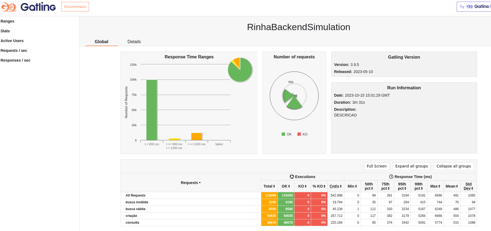

# Rinha Backend 2023 Java+Quarkus

Inspirado no vídeo do @akitaonrails, resolvi criar minha implementação (atrasada) da [Rinha de Backend](https://github.com/zanfranceschi/rinha-de-backend-2023-q3) utilizando Java com o framework Quarkus.

A imagem [gabrielluciano/rinha-2023-api-quarkus-native](https://hub.docker.com/r/gabrielluciano/rinha-2023-api-quarkus-native) foi compilada para um executável nativo utilizando seguindo [este guia](https://quarkus.io/guides/building-native-image)

Esta foi minha primeira vez utilizando o Quarkus então certamente há muitos pontos de melhorias a serem realizados neste código.

## Tecnologias utilizadas

- Java com o framework Quarkus utilizando as libs
  - RESTEasy Reactive
  - Hibernate Reactive
  - Hibernate Validator
  - Lombok
- PostgreSQL
- Nginx

## Getting Started

```shell
# Clonando o repo
git clone https://github.com/gabrielluciano/rinha-backend-2023-quarkus
cd rinha-backend-2023-quarkus

# Iniciando o projeto com o Docker Compose
docker compose up -d
```

## Resultados

Stress test realizado em VM (VMWare) com Lubuntu, 6 cores, 10 GB de RAM e HDD



## Créditos

Configurações do nginx e postgresql foram baseadas nas implementações do @viniciusfonseca e @zsantana
